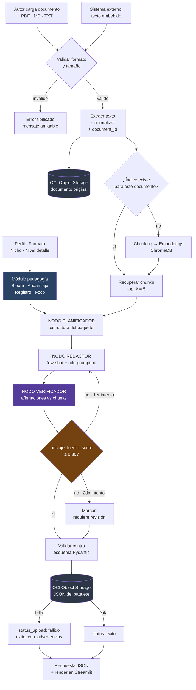

# 🎓 NuevaMente

**Sistema Inteligente de Adaptación y Generación de Contenido Educativo**

Hackathon ONE G10 — Oracle Next Education & Alura · Equipo LATAM 28

---

## El problema

Las empresas y escuelas de tecnología producen documentación técnica muy rica, pero a menudo
inaccesible para quien no domina la jerga. Un mismo manual de infraestructura en la nube
necesita enseñarse de maneras muy distintas a quien da sus primeros pasos en programación y
a quien toma decisiones ejecutivas de inversión.

Adaptar ese material a mano consume **semanas** de trabajo de especialistas y diseñadores
instruccionales.

## La solución

NuevaMente ingiere documentación técnica (PDF, Markdown o texto) y la convierte automáticamente
en **paquetes educativos personalizados**, parametrizados por perfil del destinatario, formato
pedagógico y nicho de aplicación. Minutos en lugar de semanas.

**El diferenciador no es generar contenido con IA — eso es commodity. Es generar contenido con
fidelidad verificable a la fuente.** Cada paquete trae un `anclaje_fuente_score` calculado por un
agente verificador independiente, y cada ítem declara de qué fragmento del documento original salió.

---

## Cómo funciona



### Las tres piezas que lo distinguen

**1 · RAG con trazabilidad por fragmento.** Cada chunk conserva su documento de origen y su
posición. Sin eso, un puntaje de fidelidad sería un número inventado.

**2 · Verificador independiente.** Una segunda llamada al LLM, con rol distinto, recibe *sólo*
las afirmaciones generadas y los chunks recuperados — nunca el prompt del redactor ni el perfil.
Clasifica cada afirmación como soportada, parcial o no soportada. El score es la proporción
soportada. **No es el mismo modelo poniéndose una nota.**

**3 · Adaptación cognitiva, no cosmética.** El perfil no se pasa como una instrucción vaga al
modelo: se traduce a parámetros concretos —nivel de la taxonomía de Bloom, grado de andamiaje,
registro lingüístico y foco— que el redactor consume. Así el contenido no cambia sólo de tono,
cambia de nivel cognitivo.

---

## Stack

| Capa | Tecnología |
|---|---|
| LLM redactor y verificador | Google Gemini (intercambiable por `.env`: Ollama, DeepSeek, Claude, Kimi) |
| Embeddings | Ollama local (`nomic-embed-text`) |
| Vector store | ChromaDB, una colección por documento |
| Orquestación | LangGraph |
| Validación | Pydantic v2 |
| Interfaz | Streamlit |
| Persistencia | **Oracle Cloud Infrastructure — Object Storage, capa Always Free** |

Ningún archivo del proyecto nombra un proveedor de LLM salvo `src/llm_provider.py`. Cambiar de
proveedor es cambiar una línea del `.env`.

---

## Instalación

### Requisitos

- Python 3.11 o superior
- [Ollama](https://ollama.com/download) — para los embeddings locales
- Una cuenta de Oracle Cloud con un bucket de Object Storage en la capa Always Free
- Una clave de API de Google Gemini ([aistudio.google.com/apikey](https://aistudio.google.com/apikey))

### Pasos

```bash
# 1. Clonar
git clone https://github.com/<organizacion>/G10-LATAM-equipo-28.git
cd G10-LATAM-equipo-28

# 2. Entorno virtual
python -m venv .venv
source .venv/bin/activate          # Windows:  .venv\Scripts\activate

# 3. Dependencias
pip install -r requirements.txt

# 4. Modelo de embeddings local
ollama pull nomic-embed-text

# 5. Configuración
cp .env.example .env               # Windows:  copy .env.example .env
#    Abrir .env y completar: GEMINI_API_KEY, OCI_BUCKET_NAME, OCI_NAMESPACE

# 6. Credenciales de OCI
#    Consola OCI → Perfil → My profile → API keys → Add API key
#    Guardar el bloque de configuración en ~/.oci/config

# 7. Verificar que todo quedó bien
python verificar_entorno.py
```

`verificar_entorno.py` revisa las 20+ condiciones necesarias y, por cada una que falle, dice
el comando exacto para arreglarla.

> ⚠️ El archivo `.env` **nunca** se versiona. Ya está en el `.gitignore`. Una clave subida a
> GitHub no se borra con `git rm`: queda en el historial y hay que rotarla.

### Ejecutar

```bash
streamlit run app.py        # interfaz
pytest tests/ -q            # pruebas
```

---

## Estructura

```
.
├── CLAUDE.md               memoria del proyecto (decisiones, contrato, reglas)
├── app.py                  interfaz Streamlit
├── verificar_entorno.py    verificador de entorno
├── src/
│   ├── config.py           toda la configuración entra por aquí
│   ├── llm_provider.py     único archivo que nombra proveedores de LLM
│   ├── errores.py          catálogo de códigos y contrato de error
│   ├── contracts/          ⭐ la frontera del sistema — congelado
│   ├── ingesta/            extracción de PDF, Markdown y texto
│   ├── rag/                chunking, embeddings, vector store, recuperación
│   ├── pedagogia/          perfil → parámetros pedagógicos
│   ├── orquestacion/       grafo LangGraph y sus nodos
│   ├── prompts/            plantillas, fuera de la lógica
│   └── persistencia/       OCI Object Storage
├── notebooks/              pipeline RAG documentada
├── ejemplos/               ejemplos de ejecución
├── tests/
└── docs/                   especificación funcional y decisiones
```

`src/contracts/` es la frontera: mientras esos modelos estén congelados, el equipo trabaja en
paralelo sin pisarse. Cada quien programa contra el contrato, no contra el código del otro.

---

## El contrato

**Entrada:**

```json
{
  "documento_titulo": "Introduccion a la Arquitectura de Redes VCN en OCI",
  "documento_contenido": "La Virtual Cloud Network (VCN) es una red privada...",
  "perfil_destinatario": "Principiante",
  "formato_salida": "Flashcards",
  "nicho_sector": "General",
  "nivel_detalle": "Didactico"
}
```

**Salida:**

```json
{
  "status": "exito",
  "metadatos": {
    "perfil_aplicado": "Principiante",
    "formato_generado": "Flashcards",
    "tiempo_estimado_estudio_minutos": 5,
    "conceptos_clave": ["VCN", "Subredes", "Internet Gateway", "Security Lists"],
    "prerrequisitos": ["Nociones basicas de redes"]
  },
  "contenido_adaptado": {
    "titulo": "Dominando Redes en la Nube (VCN) desde Cero",
    "introduccion_contextualizada": "Imagina la VCN como tu propio barrio privado...",
    "items": [
      {
        "frente": "Que es una VCN en Oracle Cloud?",
        "dorso": "Es tu red virtual privada dentro de la nube de Oracle.",
        "pista_didactica": "Piensa en ella como el terreno cercado donde residen tus servidores.",
        "anclaje": ["chunk_001"]
      }
    ]
  },
  "evaluacion_calidad": {
    "anclaje_fuente_score": 0.98,
    "claridad_pedagogica": "Alta",
    "observaciones": "Lenguaje ajustado con analogias para publico principiante."
  },
  "almacenamiento_oci": {
    "bucket": "nuevamente-contenidos-educativos",
    "objeto_id": "contenido-vcn-principiante-flashcards-001.json",
    "status_upload": "completado"
  }
}
```

### Parámetros

| Parámetro | Valores |
|---|---|
| `perfil_destinatario` | `Principiante` · `Desarrollador` · `Lider Tecnico` · `Gestor Ejecutivo` |
| `formato_salida` | `Flashcards` · `Tutorial` · `Resumen Ejecutivo` · `Quiz` |
| `nicho_sector` | `Fintech` · `Salud` · `E-commerce` · `General` |
| `nivel_detalle` | `Didactico` · `Estandar` · `Profundo` |

Se acepta también la forma larga de cada valor (`"Principiante / Transición de Carrera"`,
`"Flashcards de Memorización"`), con o sin tildes.

---

## Estado

| Componente | Estado |
|---|---|
| Contratos tipados (`src/contracts/`) | ✅ 38 pruebas en verde |
| Configuración y proveedores de LLM | ✅ |
| Catálogo de errores | ✅ |
| Verificador de entorno | ✅ |
| Ingesta y pipeline RAG | 🚧 |
| Módulo de pedagogía | 🚧 |
| Grafo de orquestación y verificador | 🚧 |
| Persistencia en OCI | 🚧 |
| Interfaz Streamlit | 🚧 |

---

## Documentación

| Documento | Contenido |
|---|---|
| [`docs/nuevamente-especificacion-funcional.md`](docs/nuevamente-especificacion-funcional.md) | Especificación completa: 52 requisitos MUST, 20 user stories, 63 criterios de aceptación, matriz de trazabilidad |
| [`docs/02_Decision-gate_v2_RESUELTO.md`](docs/02_Decision-gate_v2_RESUELTO.md) | Las 8 decisiones de producto y los esquemas JSON de cada formato |
| [`docs/04_Arquitectura-y-plan-de-trabajo.md`](docs/04_Arquitectura-y-plan-de-trabajo.md) | Decisiones técnicas con su justificación |
| [`docs/05_Arranque-del-equipo.md`](docs/05_Arranque-del-equipo.md) | Prerrequisitos y reparto de trabajo |
| [`CLAUDE.md`](CLAUDE.md) | Memoria del proyecto |

Cada afirmación sobre el Hackathon en esos documentos está etiquetada `[EXP]` (explícito en el
documento oficial, con página), `[INF]` (inferencia necesaria) o `[PROP]` (propuesta).

---

## Equipo

Grupo 10 · LATAM · Equipo 28 — Programa ONE, Oracle Next Education & Alura.

---

## Licencia

Proyecto académico desarrollado en el marco del Programa ONE. Uso exclusivo de servicios de la
capa Always Free de Oracle Cloud Infrastructure.
