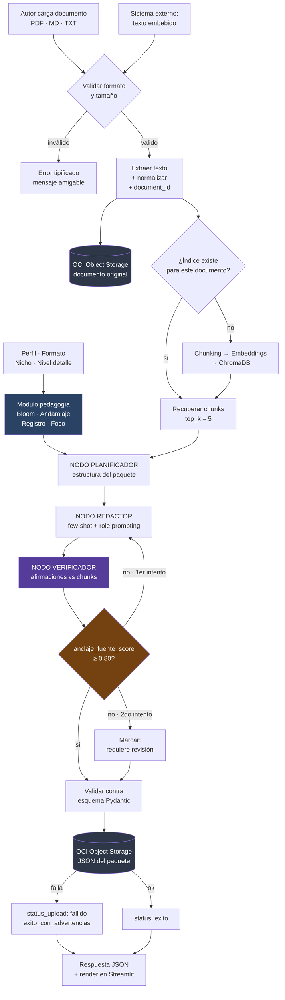

# NuevaMente — Arquitectura ligera y plan de trabajo

**Fecha:** 18 de septiembre de 2026
**Fase:** 2 de 3 — Arquitectura · **Gate anterior cerrado** (`02_Decision-gate_v2_RESUELTO.md`)
**Entrega asumida:** ~9 de octubre de 2026 (con la semana extra)

> ⚠ **Supuesto que hay que confirmar:** este plan asume **21 días** (semana extra concedida) y trabajo **todos los días**. Si la entrega sigue siendo el **2 de octubre**, el margen es **–1 h** y hay que volver a 3 formatos de inmediato. Todo lo demás del documento sigue siendo válido; cambia sólo el calendario de §4.

---

## 0. Situación

**Nada está construido.** El flujo de 4 agentes que mencionaba la propuesta de Marely era una preaprobación verbal a una idea de Franklin, no código. Se descarta ese supuesto: el sistema multi-agente vuelve a ser una **decisión de arquitectura por tomar**, no un hecho consumado.

| Escenario | Capacidad | Alcance | Margen |
|---|---|---|---|
| Sin semana extra (2 oct), todos los días | 126 h | 127 h | **–1 h** 🔴 |
| **Con semana extra (9 oct), todos los días** | **189 h** | 127 h | **+62 h (+49%)** 🟢 |
| Con semana extra, sólo lun-vie | 135 h | 127 h | +8 h 🟡 |

Con la semana extra el proyecto pasa de *"sólo si nada sale mal"* a *"cabe con margen para que algo salga mal"*. Ese margen de 62 h **no es tiempo libre: es el seguro del proyecto.** La regla del resto del documento es no gastarlo antes de tiempo.

---

## 1. Decisiones de arquitectura

Estas son las Q-23 a Q-31 que el Decision Gate dejó deliberadamente abiertas.

| # | Decisión | Elección | Por qué |
|---|---|---|---|
| **Q-23** | LLM redactor | **Gemini** (capa gratuita), respaldo configurado por `.env` | Referencia trabajada en clase (p.6), capa gratuita usable. El respaldo ya está resuelto por `llm_provider.py`: cambiar de proveedor cuesta una línea |
| **Q-24** | Embeddings | **Ollama local** (`nomic-embed-text`) | Es la llamada de mayor volumen —una por chunk—. Local significa gratis, ilimitado, **y sin dependencia de red durante la indexación**, lo que además protege la demo |
| **Q-25** | Vector Store | **ChromaDB**, persistente en disco, **una colección por `document_id`** | Sugerido por el documento (p.3), nativo en LangChain, persistencia trivial. La colección por documento **es** la decisión D-07 implementada |
| **Q-26** | Orquestación | **LangGraph** | Ver §1.1 — es la decisión con más matiz |
| **Q-27** | Interfaz | **Streamlit** | Carga de archivos incorporada, es lo más rápido de construir, y es una de las dos opciones que el documento nombra (p.6) |
| **Q-28** | Validación tipada | **Pydantic v2** | El documento lo sugiere explícitamente (p.6). Cubre `FR-OUT-02`, `FR-OUT-03` y `FR-OUT-05` con un solo mecanismo |
| **Q-29** | Chunking y recuperación | `chunk_size=1000`, `overlap=150`, `k=5` | Punto de partida razonable, ya parametrizado en `.env`. **Se ajusta con los documentos reales del 23 de septiembre**, no antes |
| **Q-30** | Despliegue | **Local para el MVP.** OCI Compute sólo si el margen aguanta después del 5 de octubre | Es diferencial opcional (p.4). No se toca hasta que las 8 casillas estén cerradas |
| **Q-31** | Estructura de repositorio | Ver §2 | — |

### 1.1 · Sobre LangGraph — la única decisión con matiz

**Elección: LangGraph.** Tres razones, en orden de peso:

1. **El lazo de reintento de la decisión D-03 es literalmente una arista condicional.** `score < 0.80 → regenerar una vez → volver a verificar`. En una cadena lineal eso se implementa con un `while` incrustado en el código de orquestación, que es exactamente el tipo de lógica que después nadie entiende. En un grafo es una arista con condición, y se ve en el diagrama.
2. **Vuelve alcanzable el diferencial multi-agente (p.6) sin trabajo extra.** Los nodos del grafo *son* los agentes. El "Agente Crítico/Revisor" del documento **es** el verificador de fidelidad de D-02: una sola pieza que cumple un requisito obligatorio y un diferencial opcional a la vez.
3. **Franklin ya lo propuso y tiene respaldo del equipo.** Trabajar contra la motivación de quien va a construirlo es mal negocio.

**Costo honesto:** LangGraph tiene curva de aprendizaje y es más ceremonia que una cadena simple.

> **🔻 Disparador de repliegue — 25 de septiembre**
> Si a esa fecha el grafo no ejecuta de punta a punta, **se colapsa a una cadena lineal de LangChain**. Las tres responsabilidades (planificar, redactar, revisar) no cambian; cambia sólo el cableado. Es ~4 h de conversión y elimina el riesgo. **Decidirlo el 25, no el 5 de octubre.**

---

## 2. Estructura del repositorio

```
nuevamente/
├── .env.example                 ✅ ya entregado
├── .env                         ⛔ NUNCA se versiona
├── .gitignore                   🔴 crear ANTES del primer commit
├── README.md                    ← casilla 8: arquitectura + diagrama + instalación
├── requirements.txt
├── app.py                       ← Streamlit: punto de entrada
│
├── src/
│   ├── config.py                ✅ ya entregado
│   ├── llm_provider.py          ✅ ya entregado
│   ├── errores.py               ← catálogo de códigos (Decision Gate §3.3)
│   │
│   ├── contracts/               🔴 LA FRONTERA: se congela primero
│   │   ├── request.py           ← SolicitudAdaptacion
│   │   ├── response.py          ← PaqueteEducativo, Metadatos, EvaluacionCalidad
│   │   └── formatos.py          ← los 4 esquemas de items[]
│   │
│   ├── ingesta/
│   │   ├── extractor.py         ← PDF (PyPDF) · Markdown · texto
│   │   └── normalizador.py
│   │
│   ├── rag/
│   │   ├── chunker.py
│   │   ├── indexador.py         ← Chroma, colección por document_id (D-07)
│   │   └── recuperador.py
│   │
│   ├── pedagogia/               ← módulo de Marely, función pura
│   │   ├── bloom.py
│   │   ├── andamiaje.py
│   │   ├── registro.py
│   │   ├── foco.py              ← el cuarto eje propuesto
│   │   └── mapping.py
│   │
│   ├── orquestacion/
│   │   ├── estado.py            ← EstadoGeneracion
│   │   ├── grafo.py             ← LangGraph
│   │   ├── nodo_planificador.py
│   │   ├── nodo_redactor.py
│   │   └── nodo_verificador.py  ← D-02 · también es el "Agente Crítico" (p.6)
│   │
│   ├── prompts/                 ← plantillas, fuera del código
│   │   ├── planificador.py
│   │   ├── redactor.py          ← consume el fragmento de pedagogia/
│   │   └── verificador.py
│   │
│   └── persistencia/
│       └── oci_storage.py       ← subir documento + JSON, degradación (D-05)
│
├── notebooks/
│   └── pipeline_rag.ipynb       ← "Notebook o módulos" (p.3)
├── ejemplos/                    ← los 3+ ejemplos de ejecución (casilla 7)
├── docs/
│   ├── 01-especificacion-funcional.md
│   ├── 02-decision-gate.md
│   └── arquitectura.md
└── tests/
```

**Principio que ordena todo:** `contracts/` es la frontera. Mientras los modelos Pydantic estén congelados, las tres personas pueden trabajar en paralelo sin pisarse. Por eso es lo primero.

---

## 3. Diagrama del flujo

Va en el README. GitHub renderiza Mermaid de forma nativa, así que esto **cumple la casilla 8** sin necesidad de exportar una imagen.

````markdown

````

Se ve en el diagrama que el nodo verificador y el lazo de reintento son la parte distintiva: eso es lo que hay que señalar en el pitch.

---

## 4. Plan de trabajo — 21 días, 3 personas

### 4.1 · Los tres carriles

Repartidos para **minimizar bloqueos**, no para igualar horas.

| Carril | Contenido | Responsable sugerido |
|---|---|---|
| **A · Datos** | Ingesta, extracción, normalización, chunking, embeddings, Chroma, recuperación | Perfil con experiencia en Python de datos |
| **B · Inteligencia** | Grafo, nodos, prompts, módulo de pedagogía, verificador de fidelidad | **Marely** (pedagogía, es suya) + **Franklin** (grafo, lo propuso) |
| **C · Superficie** | Contratos Pydantic, Streamlit, OCI, manejo de errores, README y diagrama | Perfil que pueda sostener documentación además de código |

> Marely y Franklin quedan naturalmente en el carril B por lo que cada uno propuso. El carril A y el C se reparten según quién pueda sostener la documentación, que es lo que más se abandona bajo presión.

### 4.2 · Fases y puntos de control

**FASE 0 · 18–22 sept · Cimientos** *(nadie puede avanzar sin esto)*

| Tarea | Carril |
|---|---|
| `.gitignore` con `.env`, repo creado, ramas acordadas | C |
| **Congelar los modelos Pydantic de `contracts/`** | C, revisado por todos |
| Crear el bucket OCI y **subir un archivo de prueba a mano** | C |
| Instalar Ollama, descargar modelo de embeddings, verificar | A |
| Verificar clave de Gemini con una llamada real | B |
| Esqueleto de carpetas con módulos vacíos y sus firmas | Todos |

> **🔴 Punto de control — 22 sept**
> **Contratos congelados y un archivo visible en el bucket de OCI.**
> Si OCI no funciona el 22, es la alarma más grave posible: es la única casilla sin sustituto. Se detiene todo lo demás hasta resolverla.

**FASE 1 · 23–30 sept · Rebanada vertical**

Un solo camino completo, con **2 formatos** (Flashcards + Tutorial):

| Carril | Trabajo |
|---|---|
| A | Extractores → normalizador → chunker → Chroma → recuperador |
| B | Grafo con los 3 nodos · prompts base · módulo de pedagogía completo · verificador + umbral |
| C | Streamlit funcional · subida a OCI · degradación controlada · errores |

- **23 sept:** llegan los documentos reales. **Ajustar chunking con ellos, no antes.**
- **🔻 25 sept:** disparador LangGraph → si el grafo no corre, se colapsa a cadena.
- **🔴 Punto de control — 30 sept:** una generación completa, de archivo cargado a JSON en el bucket, con 2 formatos y el verificador operando.

**FASE 2 · 1–5 oct · Ampliación**

| Trabajo |
|---|
| Formatos 3 y 4: TL;DR y Quiz |
| Campo `anclaje` por ítem |
| Cuarto eje `foco` en pedagogía |
| Los 4 perfiles afinados |
| Pruebas unitarias de los ejes pedagógicos |

> **🔴 Punto de control — 5 oct: CONGELAMIENTO DE CÓDIGO.**
> Lo que no esté funcionando el 5 de octubre no entra. Del 6 en adelante **sólo** documentación, ejemplos y pitch. Esta es la regla que decide si entregan algo completo o cuatro cosas a medias.

**FASE 3 · 6–9 oct · Evidencia y pitch** *(esto es el 37,5% de la evaluación)*

| Tarea | Fecha |
|---|---|
| README con arquitectura, diagrama Mermaid y guía de instalación | 6 oct |
| Notebook de la pipeline | 6 oct |
| Los 3+ ejemplos de ejecución, con entrada, JSON y captura del bucket | 7 oct |
| **Grabar la demo en video** | **7 oct** |
| Guion del elevator pitch · 2 ensayos cronometrados | 8 oct |
| Revisión final: `git log --all -- .env` debe salir vacío | 9 oct |
| **Entrega** | 9 oct |

### 4.3 · Cómo gastar el margen de 62 h

En este orden estricto. **Nada de la lista se toca antes de cerrar las 8 casillas.**

1. **Reserva de imprevistos — 30 h.** No se asigna. Es el seguro.
2. Quinto formato (Guion de Clase), cuyo esquema ya está definido — 3 h
3. Quiz con retroalimentación en tiempo real (diferencial, p.6) — 8 h
4. Exportación a Markdown / CSV para Anki (diferencial, p.6) — 6 h
5. Despliegue en OCI Compute (diferencial, p.4) — 10 h

---

## 5. Los tres ensayos del pitch

El elevator pitch son 5 minutos y la demo en vivo cabe en **90 a 120 segundos**. Con eso alcanza para:

1. Cargar un documento **ya indexado** (D-07 hace que esto sea instantáneo).
2. Generar **Principiante / Flashcards**.
3. Generar **Gestor Ejecutivo / TL;DR** sobre el mismo documento.
4. Señalar el `anclaje_fuente_score` y **de qué fragmento salió una tarjeta**.

Ese cuarto punto es el remate. Todos los equipos van a mostrar que un LLM genera contenido; casi ninguno va a poder señalar de dónde salió cada afirmación.

**Y el video de respaldo se graba el 7 de octubre.** Dos horas que eliminan por completo el riesgo de que una red ajena arruine la presentación.

---

## 6. Qué necesito de ustedes para seguir

| # | Punto | Cuándo |
|---|---|---|
| 1 | **Confirmar la semana extra** y la fecha real de entrega | Hoy |
| 2 | Asignar nombres a los carriles A, B y C | 19 sept |
| 3 | ¿Entra la cuarta persona? Si sí, el carril A se parte en dos | 19 sept |
| 4 | Confirmar LangGraph, o pedir que diseñe la variante en cadena | 19 sept |

Con eso, lo siguiente que produzco son los **modelos Pydantic de `contracts/`** — que es lo que hay que congelar el 22 de septiembre para que las tres personas puedan trabajar en paralelo sin bloquearse.
